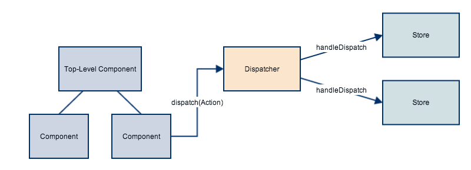
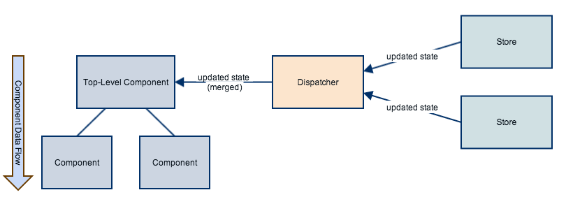

Imgsible
========

Imgsible is an image upload and sharing site in the spirit of the excellent image sharing site [Imgur](http://imgur.com) built to demonstrate building a non-trivial isomorphic application with [React](http://facebook.github.io/react/).

Running
-------

Prerequisites:

* Node.js
* Redis
* GraphicsMagick

On OS X, these are all available via [Homebrew](http://brew.sh/).

Once you have satisfied the prerequisites, you can install and start the application. Clone the app, and from its directory run:

1. `npm install`
2. `redis-server conf/redis.development.conf` (in another console, or in the background)
3. `npm start`

The client bundle will automatically build and the web server will start. Use the `PORT` environment variable if you want to specify the port the HTTP server binds to.

Architecture
------------

> **Note:** This is in no way the ideal architecture. It has some drawbacks; see the ["Limitations" section](#limitations), below, for details. It does, however, solve some of my problems, so here it is. :)

When a view needs to update the application-level state--for instance, when the user interacts with the UI--it uses the *Dispatcher*. The dispatcher is an object that references one or more *Stores* and dispatches *Actions* to each of them.

Stores are added to the Dispatcher via its `register` method. The Store must implement a `handleDispatch` method, taking `type` and `data` parameters, to handle Actions dispatched from the Dispatcher. `handleDispatch` must return the portion of the application state that the Store manages (or a promise of that state if the handler is asynchronous).

Actions are dispatched via the Dispatcher's `dispatch` method. A set of objects--normally one per Store--provide methods to generate Actions. An Action's `type` simply identifies it, providing a way for Stores to determine if they care about the Action; an Action's `data` can be anything.



Once every piece of state has been resolved from the promises returned from the Stores' `handleDispatch` methods, they are merged together to form the object that will be passed to React's `setState` method. In addition, the `dispatch` method returns a promise of this merged state--this is mostly useful on the server, where you must know when the state is ready so you can call `renderComponentToString`.



```javascript
function ImageStore() {}

ImageStore.prototype.handleDispatch = function(type, data) {
  // ...
  return myStateOrAPromiseOfMyState;
};

var dispatcher = new Dispatcher();
dispatcher.register(new ImageStore());
dispatcher.register(someOtherStore);

var statePromise = dispatcher.dispatch(ImageActions.loadImage(imageId));
statePromise.then(function(state) {
  console.log('The new state will be:', state);
});
```

The Dispatcher is an EventEmitter; the top-level React component for an application can listen for the `stateUpdate` event which is emitted when the promises for an Action are resolved, and provides the same data as the promise returned from `dispatch`.

Once the top-level component calls `setState`, the updated state flows downward to child components, none of which have access to the Stores directly. Since there is a period of time between a view dispatching an Action and that Action resulting in a new state being emitted, it's important that components are able to render in the absence of that state. For example, the `ImageView` component shows a loading message if it doesn't yet have its image data.

### Accessing the Dispatcher

A React [mixin](http://facebook.github.io/react/docs/reusable-components.html#mixins) called `DispatcherMixin` is used to provide a `dispatch` property on each component it is included in. For it to work, the very top-level component that includes the mixin must have a `dispatcher` property that references a Dispatcher. All child components that include the mixin will receive the property automatically, and do not need to have a property referencing the Dispatcher.

### Server Rendering

On the server, we set up the Stores so that they use a server-appropriate strategy for responding to events. When a request comes in for a particular URL, we trigger the appropriate Actions for that page and collect the promises returned. When they are all resolved, we render the top-level component as a string and pass in the merged state as a property.

Additionally, the merged state is provided to the client via a property on `window` so that the client-app can boot with the same data. This gives us server rendering of the application with a transparent upgrade to a fully functional front-end React app when the JavaScript loads.

### Limitations

There are, currently, some limitations to this approach. For one, Stores cannot use information from each other. For example, one Action tells the `RouteStore` to update the `route` portion of the state, while a separate Action tells the `ImageStore` to load the image data for a given image. There is no way for the `RouteStore` to use some of the image data--say, the title--to update a portion of *its* state. Ideally, dependencies could be set up between the stores, which would also remove the need to fire multiple Actions to get the UI in a certain state.

Additionally, the Dispatcher can potentially get a bit confused if multiple Actions are dispatched very close together and one of the Stores is slow to resolve its promise. The race condition caused by the ordering of the promises being resolved can end up setting state that is not accurate. In practice (so far) this isn't a huge issue because most Actions only affect one store and long-running asynchronous actions tend to be relatively far apart.

Finally, it's difficult for Stores to *push* data to the UI when their state changes asynchronously--for example, an Action that starts a file upload returns a single promise, but it may be useful to provide multiple UI updates as the upload progresses. Currently, the Dispatcher has a method called `refreshState` that calls `getState` on each Store and merges them together, but this is not a great long-term solution.

But what about...
-----------------

* **Why not use react-async and react-router-component?** One of my goals with this app was to determine how complicated things like routing and asynchronous data loading were, so I built them by hand. The aforementioned libraries, as well as many others, are great resources.
* **Why is routing handled by a Store?** I thought it would be interesting to see how it would look if the `route` portion of the application state was handled by a Store like any other piece of the state.
